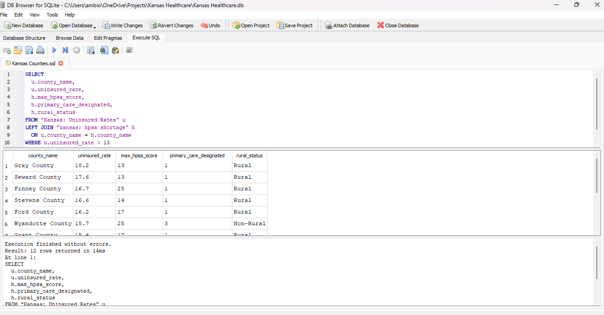

# Kansas Healthcare Access | Data Analysis & Business Insights


## Project Overview

This project analyzes healthcare access across all **105 Kansas counties** using real public data from the U.S. Census Bureau and the Health Resources & Services Administration (HRSA). By combining county-level uninsured rates with Health Professional Shortage Area (HPSA) designations, the analysis identifies the most underserved regions in Kansas and provides data-driven policy recommendations.

**Timeline:** November 2025
**Author:** Ambio Mohamed  
**Tools:** SQLite, Tableau Public, Excel, Census SAHIE 2023, HRSA HPSA Data

---

## Key Findings

| Metric | Result |
|---|---|
| Counties Analyzed | 105 |
| Underserved Counties Identified | 12 |
| Uninsured Rate Range | 6.1% (Johnson) to 18.2% (Gray) |
| Highest HPSA Score | 25 (Finney & Wyandotte) |
| Records Processed | 5,000+ |

---

## Dashboards

### 1. Kansas Uninsured Rate Map
Color-coded choropleth showing uninsured rates across all 105 counties. Darker red = higher uninsured rate.


---

### 2. HPSA Shortage Score Map
Shows provider shortage severity by county. Darker purple = more severe shortage (score of 25 = maximum federal designation).


---

### 3. Underserved Counties Map
Highlights the 12 counties flagged by the SQL analysis as having both high uninsured rates and high HPSA scores.


---

### 4. SQL Analysis in DB Browser
Multi-table join query returning 12 underserved counties from the SQLite database.



---

## The 12 Underserved Counties

| County | Uninsured Rate | HPSA Score | Rural Status |
|---|---|---|---|
| Gray County | 18.2% | 13 | Rural |
| Seward County | 17.6% | 13 | Rural |
| Haskell County | 17.2% | — | Rural |
| Finney County | 16.7% | 25 | Rural |
| Hamilton County | 16.0% | — | Rural |
| Stevens County | 16.6% | 14 | Rural |
| Ford County | 16.2% | 17 | Rural |
| Wyandotte County | 15.7% | 25 | Non-Rural |
| Kearny County | 15.6% | — | Rural |
| Grant County | 15.4% | 17 | Rural |
| Meade County | 14.6% | 16 | Rural |
| Cheyenne County | 14.2% | 20 | Rural |

---

## Methodology

### Data Sources
- **U.S. Census Bureau SAHIE (2023)** — County-level uninsured rates for all 105 Kansas counties
- **HRSA HPSA Find Export** — Health Professional Shortage Area designations, discipline breakdowns, and severity scores

### SQL Analysis (SQLite)
Both datasets were loaded into a SQLite database and joined on `county_name`. Key queries included:

```sql
-- Identify 12 underserved counties
SELECT 
  u.county_name,
  u.uninsured_rate,
  h.max_hpsa_score,
  h.primary_care_designated,
  h.rural_status
FROM "Kansas: Uninsured Rates" u
LEFT JOIN "kansas: hpsa shortage" h 
  ON u.county_name = h.county_name
WHERE u.uninsured_rate > 13
ORDER BY u.uninsured_rate DESC;
```

### Visualizations (Tableau Public)
Three interactive dashboards were built showing:
- County-level uninsured rates (orange-red gradient)
- HPSA shortage severity (purple gradient)
- Combined underserved county overlay with rate labels

---

## Policy Recommendations

1. **Telehealth Expansion** in western Kansas counties (Gray, Seward, Haskell)
2. **Provider Incentive Programs** targeting HPSA score 25 counties (Finney, Wyandotte)
3. **Community Health Center Funding** in Ford and Cheyenne counties
4. **Medicaid Outreach Campaigns** in southwest agricultural counties
5. **Transportation Assistance** programs in Meade, Hamilton, and Kearny counties

See the full report: [`report/Kansas_Healthcare_Analysis_Report.docx`](report/Kansas_Healthcare_Analysis_Report.docx)


## Data Sources

- Census Bureau SAHIE: https://www.census.gov/data/datasets/time-series/demo/sahie/estimates-acs.html
- HRSA HPSA Find: https://data.hrsa.gov/tools/shortage-area/hpsa-find
